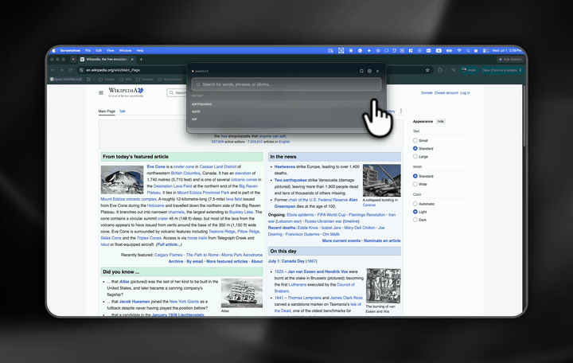

# PopDict

[](https://github.com/onlycastle/popdict/actions/workflows/ci.yml)
[](https://github.com/onlycastle/popdict/releases/latest)
[](LICENSE)


PopDict is a macOS menu-bar dictionary for English learners. Press one hotkey to
look up an English word, hear its pronunciation, see an optional translation,
and save it for later without leaving the app you are reading in.



## Install

[**Download for macOS (Apple Silicon)**](https://popdict.space/download/latest?source=github&cta=readme) —
signed, notarized, and auto-updating.

## Features

- Global hotkey popup, defaulting to `CommandOrControl+Shift+Space`.
- Optional select-to-lookup for highlighted text on macOS.
- Free Dictionary API definitions with audio playback and text-to-speech fallback.
- Google sign-in for saved words, backed by Supabase.
- Free signed-in translations in Korean, Japanese, Simplified Chinese, Spanish,
  and Brazilian Portuguese, built from Wiktionary via Kaikki.
- Recent search history, configurable hotkey, launch-at-login, and a menu-bar tray.
- Private in-app feedback with no account required.

## Requirements

- macOS 11 (Big Sur) or newer for the desktop app (Apple Silicon or Intel).
- Node.js 20.19+, 22.12+, or 24.x (matches `engines` in package.json) to build from source.

## Quick Start

```bash
npm install
cp .env.example .env.local
npm start
```

Basic English dictionary lookup works without cloud configuration. Signed-in
translations and saved words require a compatible Supabase backend;
`.env.example` lists the local variables consumed by development builds.

## Development

```bash
npm start                 # Electron Forge + Vite dev app
npm run lint              # ESLint
npm test                  # Vitest
npx tsc --noEmit          # TypeScript check
npm run harness:validate  # deterministic quality gates (also run in CI)
```

To build your own copy of the app from source:

```bash
npm run package    # produces an unsigned app under out/
```

> Official builds are signed and notarized by the maintainer; apps you build
> from a fork are unsigned. The MIT license lets you use, modify, and
> redistribute the **code** freely — see the [Trademark](#trademark) note below
> about the PopDict **name and logo**.

## Project Structure

```text
electron/    Electron main process, preload bridge, local store, updater
src/         React renderer, hooks, services, styles, and shared types
shared/      Types and validation shared across app processes
data/        Generated multilingual dictionary dataset and notices
supabase/    Database migrations and operational Edge Functions
site/        Public Next.js landing and legal pages
scripts/     Build, dataset, harness, and notarization helpers
```

## Contributing

Read [CONTRIBUTING.md](CONTRIBUTING.md) before opening a pull request. App users can
send private feedback from PopDict’s menu bar or Settings; public, reproducible bug
reports and contributor proposals can still use GitHub Issues.

## Security

Read [SECURITY.md](SECURITY.md) for vulnerability reporting guidance. Do not post
secrets or private account data in public issues.

## Acknowledgements

PopDict bundles the open-source fonts Fraunces and JetBrains Mono under the SIL
Open Font License. Definitions come from Free Dictionary / Wiktionary;
translations come from English Wiktionary via Kaikki and use the NGSL-GR
learner headword list. Full attributions and transformation details are in
[THIRD_PARTY_NOTICES.md](THIRD_PARTY_NOTICES.md).

## Trademark

The MIT license covers PopDict's source code. The name "PopDict" and the PopDict
logo are **not** part of the MIT grant. Please don't use them in a way that
implies endorsement by or affiliation with the project, and rebrand forks you
redistribute under your own name.

## License

PopDict application code is MIT licensed; see [LICENSE](LICENSE). The generated
translation dataset and normalized 3,000-word NGSL-GR list in
[`data/translations/`](data/translations/README.md) are separately licensed under
[CC BY-SA 4.0](https://creativecommons.org/licenses/by-sa/4.0/).
